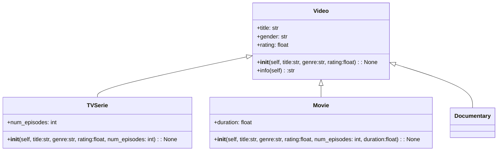

```mermaid
classDiagram
    class Video{
        +title: str
        +gender: str
        +rating: float

        +__init__(self, title:str, genre:str, rating:float): None
        +info(self):str
    }

    class TVSerie{
        +num_episodes: int

        +__init__(self, title:str, genre:str, rating:float, num_episodes: int): None
    }

    class Movie{
        +duration: float

        +__init__(self, title:str, genre:str, rating:float, num_episodes: int, duration:float): None
    }

    class Documentary{

    }


    Video<|--TVSerie
    Video<|--Movie
    Video<|--Documentary

```